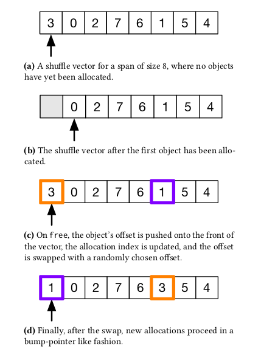

<section>
  <h1>Archived News Posts</h1>
  

    Here's what I got up to earlier in my career.
  

</section>

<section>
    

      

        
      

      

        

          June 30th, 2022 |
            <a href="../graphzeppelin" target="_blank" title="GraphZeppelin">
              GZ talk
            </a>
          
        

        

          I present the first-ever practical graph sketching system
        

      

    

    

      

        
      

      

        

          March 3rd, 2020 |
            <a href="../mesh" target="_blank" title="Landscape">
              Shuffle Vectors
            </a>
          
        

        

          a fan implementation of the shuffle vector data structure
        

      

    

</section>