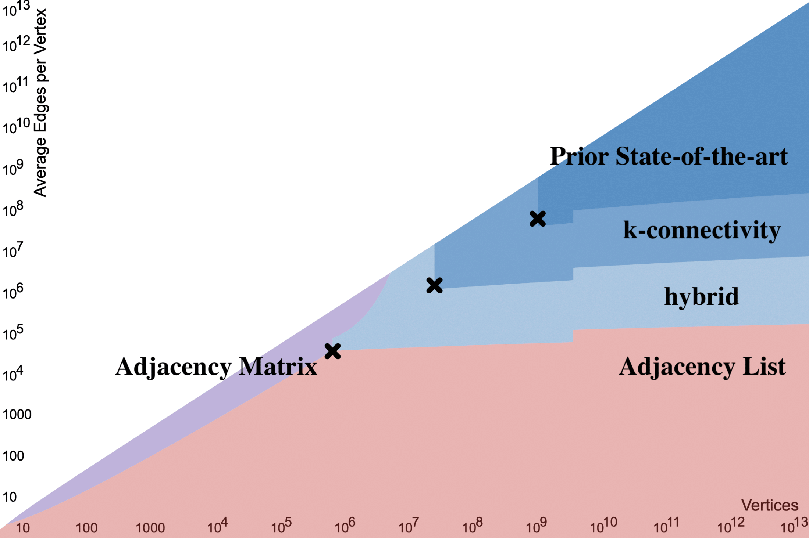

## What we're looking for:
Real-world graph data sets with _at least one million nodes_ (more is better) and at least _40 thousand unique edges per node_ (more is better). By *unique* we mean that multi-edges don't count: if there are 10 copies of an edge between nodes u and v in your dataset, we'd count that as a single edge.

(Graphs that aren't *quite* this large or dense, if you have them, would still be interesting though not ideal.)

The graph data sets can represent anything, we're not picky.  Graphs which change over time (e.g., edges may be inserted or deleted) are especially useful for our purposes.

If you have the datasets we're looking for, please [contact me via email](mailto:dtench@pm.me).

## Why we want these datasets:

I'm leading a team of researchers in building space-efficient tools for processing dynamic graphs (graphs which change over time).  These tools use linear sketching, which allows us to (sometimes approximately) compute properties of graphs using space much smaller than is required to store the graph losslessly.  The space requirements of these algorithms scale with the number of nodes in the graph, *but not the number of edges*.

This is especially useful when processing *dense* graphs (graphs that have a lot of edges per node).  Most existing graph processing systems assume that large graphs are always sparse, and optimize for computation on sparse graphs.

We believe that tools designed for computing properties of large, dense, dynamic graphs are useful, and are actively looking for real-world graph datasets which are large and dense.

The following phase-change diagram shows the set of graphs for which graph sketching is more space efficient than lossless (adjacency list or adjacency matrix) graph representations. The various shaded blue regions indicate graphs for which graph sketching saves space for connectivity and minimum cut problems. Note that the smallest graphs in this blue region have roughly a million nodes and average degree roughly 40 thousand.

Existing work
--------------

We built [GraphZeppelin](/deeplinks/graphzeppelin.pdf), a graph stream processing system which uses linear sketching techniques to space-efficiently find connected components of dynamic graphs.  The paper appeared [SIGMOD 2022](https://2022.sigmod.org/) and you can check out our [code here](https://github.com/GraphStreamingProject/GraphStreamingCC).  GraphZeppelin showcases several other advantages of linear sketching techniques: it is highly parallel, scales well to external memory and can be distributed efficiently on a cluster for even better scaling.

GraphZeppelin uses asymptotically less space to process dense graphs than state-of-the-art systems for graph stream processing.  Its space efficiency advantages become apparent even for relatively small dense graphs (hundreds of thousands of nodes).

Since then, we've built more graph sketching systems:

- Landscape, a distributed graph sketching system for connected components and k-connectivity that can process hundreds of millions of edges per second, and is several times more compact than GraphZeppelin.

- (Coming soon:) a system for sketching approximate minimum cuts with GPU acceleration, and a dynamic sketching connectivity system that can answer millions of connectivity queries per second.

