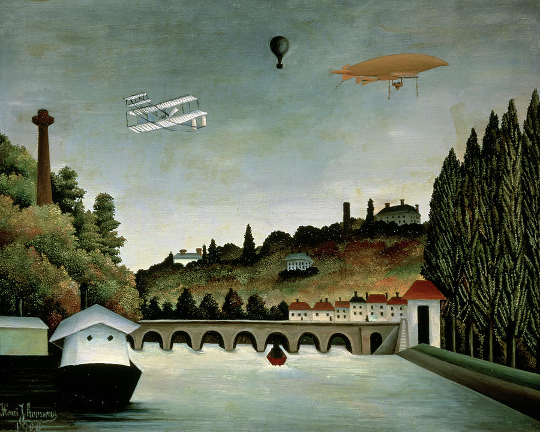

---
# Feel free to add content and custom Front Matter to this file.
# To modify the layout, see https://jekyllrb.com/docs/themes/#overriding-theme-defaults

title: David Tench

layout: default
---
# David Tench

Hi! I'm a computer scientist interested in processing massive datasets.

I design space-efficient, memory-hierarchy-aware algorithms and build systems to address massive-scale problems in areas like bioinformatics, databases, network measurement, and machine learning. I am particularly interested in designing and implementing practical graph streaming and sketching algorithms.

Check out my [one-page resume](pdfs/tench_resume.pdf) and my [academic CV](pdfs/tench_cv.pdf).

To get in touch, email me at dtench [at] pm [dot] me.

NOTE: I am currently revamping this website; some functionality may be broken. Check back soon.

## Latest News
<section>
    

      

        
      

      

        

          January 12th, 2025 |
            <a href="landscape" target="_blank" title="Landscape">
              Landscape
            </a>
          
        

        

          Exploring the strange performance landscape of graph sketching
        

      

    

</section>